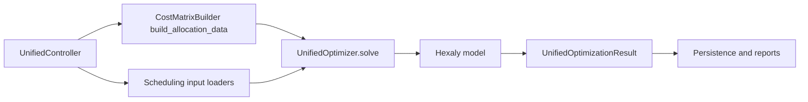

# Hexaly Model: Structure, Flow, and Usage

This document gives a high-level view of how the Hexaly-based optimization model is organized in this repository, how data flows through it, and how to run it safely.

## 1) What the model does

The unified optimizer supports three operating modes:

- `allocation_only`: assign routes to vehicles.
- `scheduling_only`: optimize charging for pre-determined route duties.
- `integrated`: optimize allocation and charging together in one weighted objective.

Primary implementation lives in:

- `src/optimizer/unified_optimizer.py`
- `src/optimizer/cost_matrix.py` (now a pairwise data preparer, not route-combination enumerator)
- `src/controllers/unified_controller.py`

## 2) High-level architecture

### Core design

- Allocation uses **Hexaly native list variables** (`m.list`) instead of pre-generated route combinations.
- Route assignment uses `m.partition(routes_by_vehicle)` so each route is assigned exactly once across vehicles (when routes exist).
- ConstraintManager contributes pairwise feasibility/scores (`feasible_vr`, `score_vr`), while sequence-level constraints (turnaround, shift span) are enforced directly in Hexaly expressions.

## 3) Input data contract for list-based allocation

`CostMatrixBuilder.build_allocation_data()` prepares:

- `score_vr` (`n_vehicles x n_routes`): pair score for vehicle-route assignment.
- `feasible_vr` (`n_vehicles x n_routes`): hard feasibility mask.
- `route_start_times` (`n_routes`): route start (minutes).
- `route_end_times` (`n_routes`): route end (minutes).
- `route_durations` (`n_routes`): route duration (minutes).
- `route_energy_required` (`n_vehicles x n_routes`): energy needed for each vehicle-route pair.
- `metadata`: allocation parameters (e.g. strict turnaround, shift limit, preferred-turnaround penalties, max routes).

In the controller, these are passed directly to `UnifiedOptimizer.solve(...)`.

## 4) Model structure by mode

## Allocation-only

Decision layer:

- `routes_by_vehicle = [m.list(n_routes) for vehicle in vehicles]`
- `m.partition(routes_by_vehicle)` (if routes exist)

Hard constraints:

- Per-vehicle route limit (`count(list) <= max_routes_per_vehicle`)
- Infeasible assignments forbidden via `m.contains(list, route_idx) == 0`
- Strict turnaround between consecutive list elements
- Strict shift-hour duration cap on list span

Objective:

- `route_count_weight * total_assigned_routes + pair_score_sum + preferred_turnaround_soft_terms`

Output extraction:

- Read route index collections from solver solution and reconstruct `(vehicle_id, route_sequence, sequence_score)` tuples.

## Scheduling-only

Uses interval-based scheduling model:

- charging interval variables
- site capacity constraints
- route energy requirement checkpoints
- optional charger power-class allocation

Objective minimizes charging cost + SOC shortfall penalties (and optional makespan term).

## Integrated

Combines:

- list-based allocation block
- interval-based scheduling block
- optional route execution intervals linked to list membership (`if_present(route_interval) == contains(route_list, r_idx)`)
- no-overlap between charging and route execution intervals

Objective is weighted:

- maximize `(allocation_term * allocation_score_weight) - (scheduling_term * scheduling_cost_weight)`

## 5) Constraint ownership

### ConstraintManager-driven (pair scoring/feasibility)

- Energy feasibility (hard, pair-level gate in `feasible_vr`)
- Charger preference (soft contribution in `score_vr`)
- Any other enabled constraints evaluated for single-route sequence

### Hexaly-native sequencing constraints

- Strict turnaround between consecutive assigned routes
- Preferred-turnaround soft penalties
- Shift-hours upper bound across assigned list span
- Partition and assignment cardinality constraints

This split keeps preprocessing lightweight while preserving sequence logic inside the solver.

## 6) Charger Continuity by Segment

When `charger_allocation` is enabled, charger assignment is modeled at **segment** granularity (power class level), not as a single whole-window assignment.

Per vehicle, segments are derived from route windows:

- `pre_first`: optimization start to first route start
- `between_i`: route `i` end to route `i+1` start
- `post_last`: last route end to optimization end

Rules:

- Power class is constant **within** each segment.
- Power class may change **between** consecutive segments.
- Continuity is enforced using segment intervals with segment class choice variables.

Capacity semantics:

- At any time/slot, occupancy per power class must not exceed available charger count for that class.
- Fixed current-connection and nighttime continuity pins are applied at segment level.

## 7) Execution flow in code

1. `UnifiedController.run_unified_optimization(...)` determines mode/config.
2. `_prepare_optimization_inputs(...)` loads routes, vehicles, states, forecasts/prices.
3. `CostMatrixBuilder.build_allocation_data()` builds pairwise allocation matrices.
4. `UnifiedOptimizer.solve(...)` builds Hexaly model for selected mode.
5. `model.close()` then `optimizer.solve()`.
6. Results are extracted to `UnifiedOptimizationResult`, converted to legacy outputs, and persisted.

## 8) Usage patterns

### API usage (`/optimize/unified`)

Use `mode` as a flag array:

- `["allocation"]`
- `["charge_scheduling"]`
- `["allocation", "charge_scheduling", "charger_allocation"]` (integrated + charger allocation)

### CLI usage

`unified_main.py` supports multi-value mode flags and maps them to internal optimizer mode.

## 9) Operational notes and guardrails

- Requires Hexaly 14.0+ with interval variable support.
- Greedy fallback still exists for Hexaly-disabled/error scenarios and uses legacy-compatible sequence tuples internally.
- `route_energy_required` is prepared for future tighter integrated SOC-path coupling; current scheduling hard checks still rely on scheduling requirement inputs.

## 10) Developer checklist for changes

- Keep all model lookups in Hexaly expressions via `m.array(...)` + `m.at(...)`.
- For list variables, prefer lambda-based aggregations (`m.sum(list_var, m.lambd(...))`) over Python loops for objective terms.
- Extract list solutions via `optimizer.solution.get_collection_value(list_var)`.
- Preserve compatibility with `UnifiedOptimizationResult.to_allocation_result(...)` tuple format.
- Run compile/lint checks after modifying model expressions.

## 11) Key files map

- `src/optimizer/cost_matrix.py`: allocation data preparation (`build_allocation_data`)
- `src/optimizer/unified_optimizer.py`: model build, solve, extraction
- `src/controllers/unified_controller.py`: orchestration and input assembly
- `docs/unified_optimizer_model.tex`: mathematical formulation (detailed)

